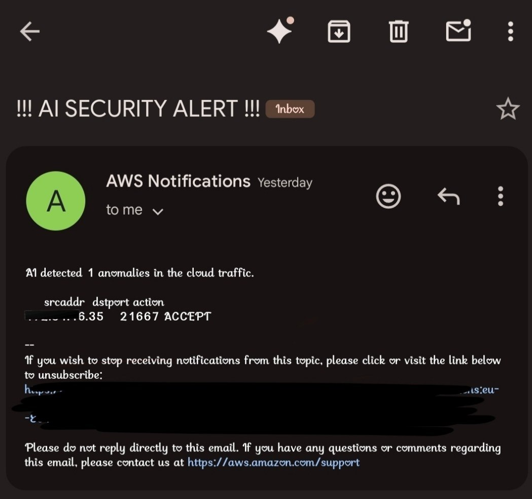

# AI-Cloud-IDS

An anomaly-based intrusion detection system for AWS traffic, using an
Isolation Forest model instead of signature matching.

## Why I built this

Most IDS setups I'd read about rely on signature-based detection — matching
traffic against a list of known attack patterns. That works fine for known
threats, but it misses anything new, and cloud traffic patterns shift fast
enough that static rules get stale quickly.

I wanted to try the other approach: learn what normal traffic looks like,
then flag whatever doesn't fit — without needing labeled attack data ahead
of time.

## The core idea

Isolation Forest is an unsupervised model that isolates anomalies rather
than classifying based on known labels. The reasoning: normal traffic is
consistent and clusters together, while anomalies are rare and easier to
separate out. It fits this use case well since I don't have a labeled
dataset of "attack" vs "normal" traffic to train on.

## How it works

1. **Data collection** — AWS VPC Flow Logs capture network traffic
2. **Storage** — logs land as compressed `.gz` files in an S3 bucket
3. **Processing** — a Python script pulls the latest log file with `boto3`
   and decompresses it in memory (`gzip` + `io.BytesIO`) instead of writing
   to disk
4. **Features** — pulls out packets, bytes, source port, destination port
5. **Detection** — Isolation Forest trains on the current dataset and
   scores each record for anomaly likelihood
6. **Alerting** — anomalies above the threshold trigger an SNS notification
   with the relevant traffic details

## Stack

- AWS: S3, EC2, SNS, VPC Flow Logs
- Python — pandas, scikit-learn, boto3
- Isolation Forest (unsupervised)

## Problems I ran into

**Compressed logs.** AWS stores flow logs as `.gz` files, and I didn't want
to write them to disk just to read them. Ended up decompressing in memory
with `io.BytesIO`, which turned out to be simpler than I expected.

**Feature selection.** Packets, bytes, and ports ended up being the most
useful signals — I tried adding a few more fields early on and it just
added noise without improving detection.

**False positives.** The first few runs flagged way too much normal
traffic as anomalous. Tuning the `contamination` parameter in the model
got this down to a manageable level, though I'm still not sure I have the
best value for it.

## Sample alert



*Triggered after unusual traffic showed up in the VPC flow logs.*

## Project structure

```
AI-Cloud-IDS/
├── ids_ai_logic.py        # Main detection script
├── README.md
├── requirements.txt
├── .gitignore
└── images/
    └── ai-security-alert.png
```

## Getting started

Clone and install:

```bash
git clone https://github.com/doolamdattatreya2025/AI-Cloud-IDS.git
cd AI-Cloud-IDS
pip install -r requirements.txt
```

Before running, set your own values for:
- S3 bucket name
- SNS topic ARN
- AWS region

(Better to pull these from environment variables than hardcode them.)

Then run:

```bash
python ids_ai_logic.py
```

## What it's caught so far

In testing, it picked up simulated intrusion attempts — unauthorized SSH
access attempts, mainly — and generated alerts within seconds, without any
predefined rule for that specific pattern. Still early-stage, so I wouldn't
call it production-ready yet.

## What I'd add next

- Save the trained model instead of retraining on every run
- Automate it with a cron job or Lambda instead of running manually
- Some kind of dashboard, even a basic one, to actually see traffic trends
  over time instead of just alerts
- Eventually hook this into a proper SIEM setup

## Author

Built by [Dattatreya](https://github.com/doolamdattatreya2025) — cybersecurity student, interested in cloud security and threat detection.
